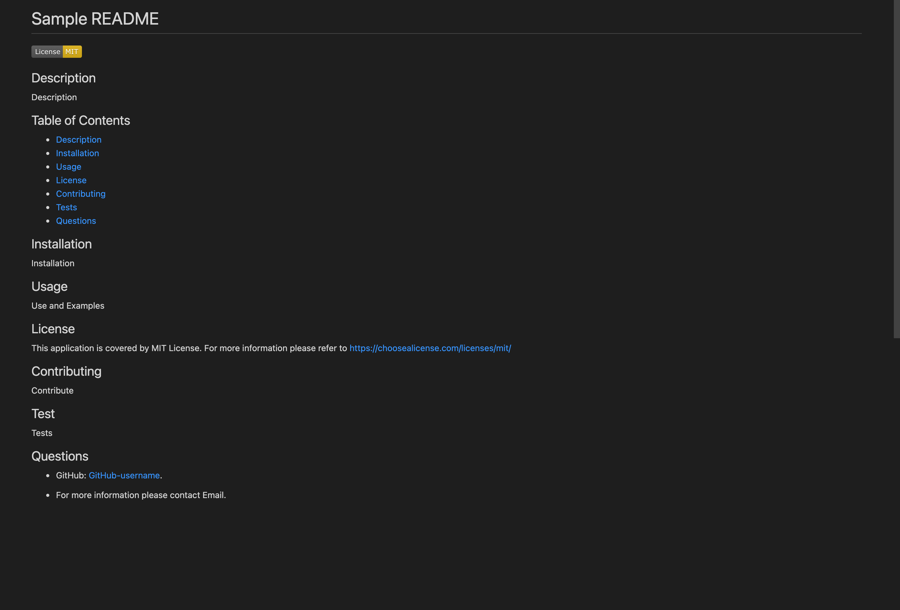

# README-Generator

  

  ## Description
  This application is a command line README.md generator. Using the terminal, node, and the inquierer package users will fill out several inputs to construct a professional README.md for their own project

  ## Table of Contents
  - [Description](#description)
  - [Installation](#installation)
  - [Usage](#usage)
  - [License](#license)
  - [Questions](#questions)

  ## Installation
  1. Clone this README-Generator repository through GitHub
  2. Access the repo using your terminal
  3. In your terminal run ```npm install```


  ## Usage
  1. Access README-Generator using your terminal
  2. Run ```node index.js```
  3. Answer each of the following prompts regarding your project
  4. The README.md file you just generated will be in the sample folder under sampleREADME.md
  5. Copy and paste your README to your project's repo. Edits can be made when you open your newly generated README in your code editor.

  Demo
  
  https://drive.google.com/file/d/1BoWx_idsYlOdft7c53P4MY9HfFPbQ_wa/view

  

  Generated sample 

  

  ## License
  This application is covered by MIT License. For more information please refer to https://choosealicense.com/licenses/mit/

  ## Questions
  * GitHub: [jkcanoy](https://github.com/jkcanoy). 

  * For more information please contact kylecanoy96@gmail.com.